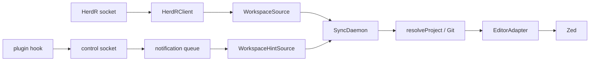
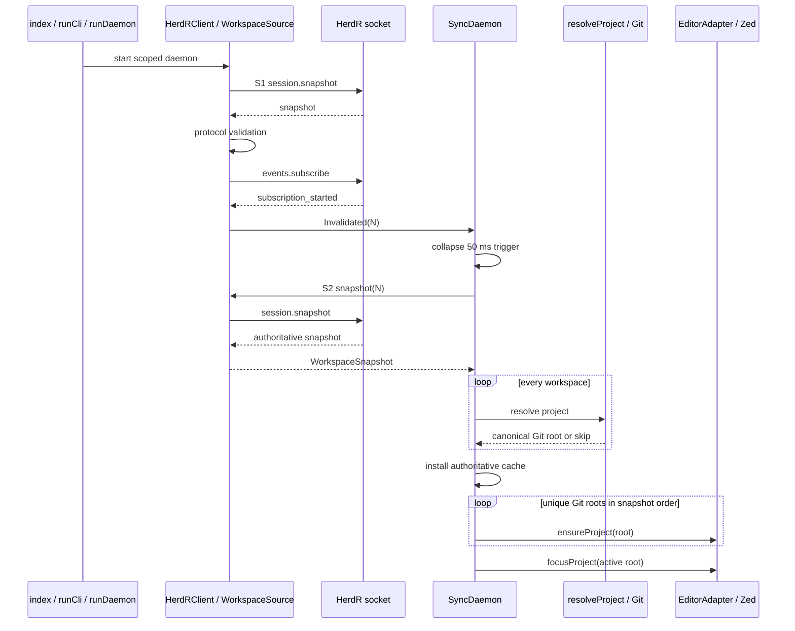
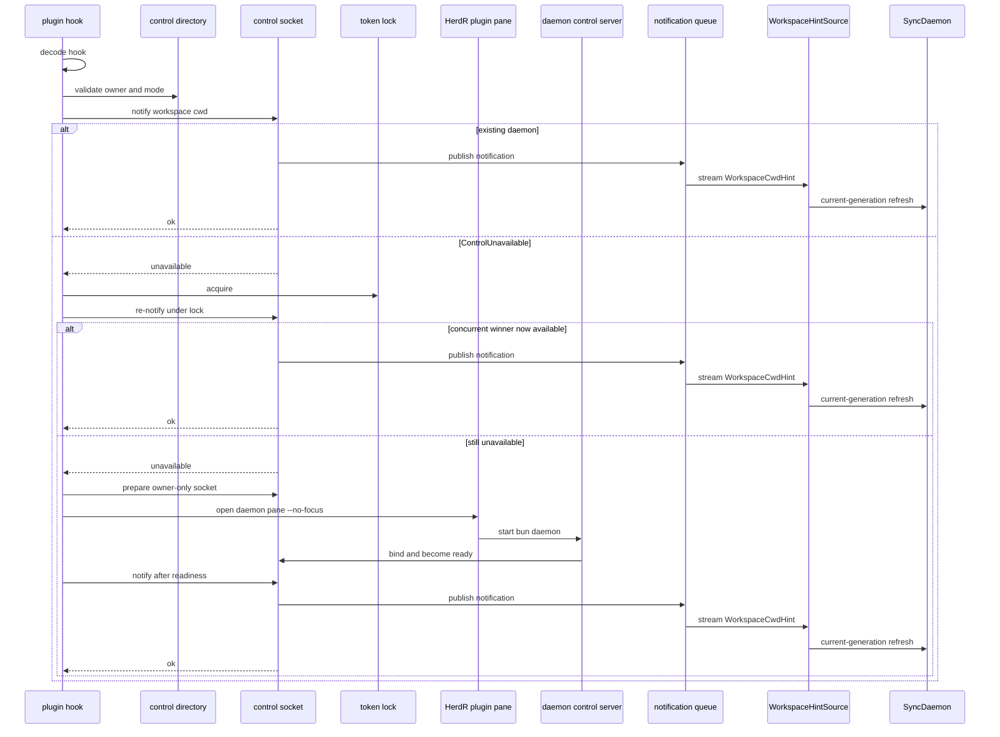

# Architecture

[Documentation index](README.md)

## Component map

The system is a read-only HerdR source plus a local plugin hint path feeding an editor-independent
core. The only editor edge is the public Zed CLI adapter.

Ownership: [HerdR workspace source](herdr.md), [Service ports](services.md),
[Synchronization core](synchronization.md), [Plugin lifecycle and control](plugin.md), and
[Zed editor adapter](editor.md).

## Normal daemon flow

The runtime does not derive editor calls from the bootstrap snapshot. S1 establishes protocol
compatibility and subscription ordering; the post-ack S2 snapshot is authoritative.

See [Runtime composition](runtime.md), [HerdR workspace source](herdr.md),
[Service ports](services.md), [Synchronization core](synchronization.md), and
[Zed editor adapter](editor.md).

## Plugin hook flow

Hook startup first attempts reuse. Only control unavailability enters the locked contender branch,
and any pane opened by the plugin is explicitly unfocused.

See [Plugin lifecycle and control](plugin.md), [Runtime composition](runtime.md),
[Service ports](services.md), and [Synchronization core](synchronization.md).

## Cross-cutting boundaries

- Protocol incompatibility prevents a source generation from becoming live.
- Malformed relevant HerdR frames are logged and isolated; an oversized unterminated transport
  frame terminates that connection and enters reconnect handling.
- Unresolved projects are logged and skipped, so they never reach the editor adapter.
- Stale generations cannot install cache state, record success, or invoke Zed.
- Control ownership and protocol failures fail closed; only control unavailability enters startup
  retry.
- Failed editor operations are not recorded as successful and remain retryable.

The graph has no reverse editor-to-HerdR call and no mutating HerdR method. Plugin control publishes
cwd hints; it does not change HerdR workspace state.

## Implementation and tests

- [`index.ts`](../index.ts) and [`src/app.ts`](../src/app.ts) compose the runtime.
- [`src/herdr/client.ts`](../src/herdr/client.ts) owns S1, acknowledgement, invalidation, and S2
  transport.
- [`src/sync/daemon.ts`](../src/sync/daemon.ts) owns generation gates and editor ordering.
- [`src/plugin/hook.ts`](../src/plugin/hook.ts) and
  [`src/plugin/control.ts`](../src/plugin/control.ts) own the hook branch.
- [`src/editor/zed.ts`](../src/editor/zed.ts) owns the only Zed invocation.
- [`test/e2e/daemon.test.ts`](../test/e2e/daemon.test.ts) exercises the normal built-daemon flow.
- [`test/plugin/control.test.ts`](../test/plugin/control.test.ts) exercises daemon reuse, startup,
  readiness, and hint publication.

## Related

- [Runtime composition](runtime.md)
- [Domain model](domain.md)
- [Service ports](services.md)
- [HerdR workspace source](herdr.md)
- [Synchronization core](synchronization.md)
- [Plugin lifecycle and control](plugin.md)
- [Zed editor adapter](editor.md)
